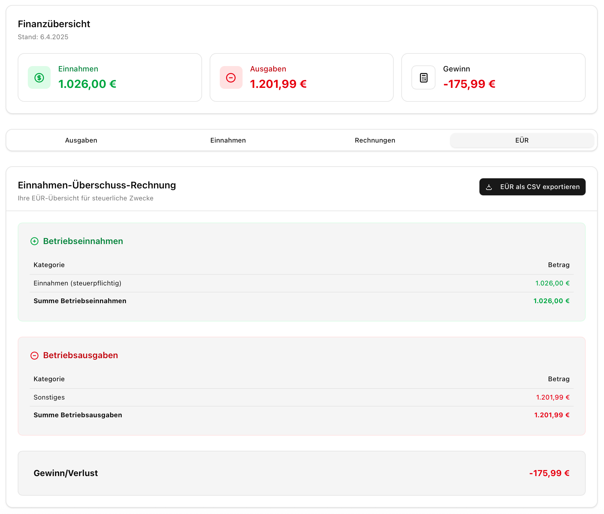

# Bivaro – Buchhaltung für Kleinunternehmer



Bivaro ist eine moderne, webbasierte Buchhaltungsanwendung, die speziell für Kleinunternehmer in Deutschland entwickelt wurde. Sie hilft dabei, Einnahmen und Ausgaben zu verwalten, Rechnungen und Angebote zu erstellen und den Überblick über die Finanzen zu behalten – alles unter Berücksichtigung der Kleinunternehmerregelung (§ 19 UStG).

> **Neu einsteigend?** Lesen Sie zuerst den Abschnitt [Erste Schritte](#-erste-schritte) – dort wird alles Schritt für Schritt erklärt.

---

## Inhaltsverzeichnis

1. [Features](#-features)
2. [Technologie-Stack](#️-technologie-stack)
3. [Projektstruktur](#-projektstruktur)
4. [Erste Schritte](#-erste-schritte)
5. [Konfiguration](#️-konfiguration)
6. [Alle npm-Scripts](#-alle-npm-scripts)
7. [Testing](#-testing)
8. [API-Dokumentation](#-api-dokumentation)
9. [Docker-Deployment](#-docker-deployment)
10. [Sicherheit & Audit-Log](#-sicherheit--audit-log)
11. [Backup & Restore](#-backup--restore)
12. [Häufige Fragen](#-häufige-fragen)
13. [Lizenz](#-lizenz)

---

## 🚀 Features

### 📊 Dashboard & Übersicht
- **Echtzeit-KPIs**: Umsatz (Monat/Jahr), Ausgaben, offene Forderungen und Gewinnmarge auf einen Blick.
- **Kleinunternehmer-Tracker**: Visueller Fortschrittsbalken für die Umsatzgrenzen ab 2025 (25.000 € Vorjahresgrenze / 100.000 € Sofortgrenze) mit Warnungen.
- **Interaktive Charts**: Monatliche Einnahmen vs. Ausgaben im Jahresverlauf.
- **Live-Daten**: Das Dashboard lädt alle Daten mit [TanStack Query](https://tanstack.com/query) automatisch im Hintergrund und hält sie aktuell.

### 📝 Rechnungen & Angebote
- **PDF-Rechnungsgenerator**: Professionelle Rechnungen direkt im Browser, mit automatischem Hinweis auf § 19 UStG.
- **E-Rechnungen**: ZUGFeRD-/Factur-X-PDFs mit PDF/A-3-Normalisierung sowie XRechnung-/UBL-XMLs importieren, strukturierte Daten übernehmen und XML exportieren.
- **GiroCode (EPC069-12)**: Optionaler QR-Code auf der Rechnung – Kunden scannen und zahlen per Banking-App.
- **Angebotsverwaltung**: Angebote erstellen und direkt in Rechnungen umwandeln.
- **Mahnsystem**: Automatische Fälligkeitserinnerungen.
- **Kundenverwaltung**: Empfänger aus der Datenbank auswählen oder manuell eingeben.
- **Kundenhinweise**: Interne Hinweise können getrennt für Rechnungserstellung und E-Mail-Versand sichtbar gemacht werden.
- **Leistungsnotizen**: Wiederverwendbare Leistungszeilen mit Leistungsdatum, Menge und Einheit lassen sich einem Kunden und optional einer Rechnung zuordnen.
- **Individuelle Vorlagen**: Logo, Adresse und Fußzeile aus den Einstellungen.

### 💰 Einnahmen & Ausgaben
- **Belege erfassen**: Einfaches Hinzufügen mit Kategorien, Datum und Betrag.
- **Beleg-Upload**: PDF- oder Bilddateien direkt zur Buchung speichern.
- **Filter & Suche**: Nach Datum, Kategorie oder Freitext filtern.
- **EÜR-Export**: Einnahmen-Überschuss-Rechnung für Steuerberater oder Finanzamt exportieren.
- **GWG-Verzeichnis**: Geringwertige Wirtschaftsgüter automatisch erfassen.

### 📒 Kassenbuch
- Digitales Kassenbuch mit Tagesabschlüssen und CSV-Export.

### ⚙️ Einstellungen
- **Firmendaten**: Name, Adresse, Steuernummer und Bankverbindung (IBAN/BIC) zentral hinterlegen.
- **Logo-Upload**: Firmenlogo hochladen für Rechnungen und Angebote.
- **Benutzerverwaltung**: Mehrere Benutzer mit Rollen (Admin / User).
- **API-Schlüssel**: Externe Integrationen über REST-API anbinden.
- **Benutzerregistrierung**: Registrierung kann vom Admin aktiviert oder gesperrt werden.

### ⚖️ Steuer-Simulation
- Einkommensteuer-Rechner: voraussichtliche Steuerlast auf Basis des aktuellen Gewinns schätzen.

### 🔐 Sicherheit & Compliance
- Passwort-Hashing mit bcrypt (Kostenfaktor 12).
- Rollenbasierter Zugriffsschutz (RBAC) auf allen API-Routen.
- Strukturierter Audit-Log: jede sicherheitsrelevante Aktion (Login, Registrierung, Backup) wird als Datenbankzeile gespeichert.
- Rate-Limiting für den Registrierungs-Endpunkt.

---

## 🛠️ Technologie-Stack

| Schicht | Technologie |
|---|---|
| Framework | [Next.js 16](https://nextjs.org/) (App Router, TypeScript) |
| UI-Bibliothek | [React 19](https://react.dev/), [Tailwind CSS v4](https://tailwindcss.com/), [shadcn/ui](https://ui.shadcn.com/) |
| Datenabruf | [TanStack Query v5](https://tanstack.com/query) |
| Datenbank | [SQLite](https://www.sqlite.org/) via [Prisma 6](https://www.prisma.io/) ORM |
| Authentifizierung | [NextAuth.js v4](https://next-auth.js.org/) |
| PDF-Generierung | [pdf-lib](https://pdf-lib.js.org/) + [Ghostscript](https://www.ghostscript.com/) für PDF/A-3-Normalisierung |
| QR-Code | [qrcode](https://github.com/soldair/node-qrcode) |
| Unit-Tests | [Vitest](https://vitest.dev/) |
| E2E-Tests | [Playwright](https://playwright.dev/) |

---

## 📁 Projektstruktur

```
bivaro-kleinunternehmen/
│
├── app/                        # Next.js App Router
│   ├── api/                    # Backend-Endpunkte (Server-seitig)
│   │   ├── auth/               # Login, Registrierung, Session
│   │   ├── backup/             # Daten-Export und -Import
│   │   ├── invoices/           # Rechnungen
│   │   ├── expenses/           # Ausgaben
│   │   ├── incomes/            # Einnahmen
│   │   ├── customers/          # Kundenverwaltung
│   │   ├── users/              # Benutzerverwaltung (nur Admin)
│   │   ├── openapi/            # OpenAPI-Spezifikation als JSON
│   │   └── v1/                 # Externe REST-API (mit API-Key)
│   ├── dashboard/              # Dashboard-Seite
│   ├── settings/               # Einstellungen (inkl. Backup/Restore)
│   ├── login/ register/        # Authentifizierungs-Seiten
│   └── ...weitere Seiten
│
├── components/                 # Wiederverwendbare UI-Komponenten
│   ├── dashboard/              # Dashboard-spezifische Komponenten
│   │   ├── dashboard-content.tsx        # Haupt-UI des Dashboards
│   │   ├── dashboard-query-provider.tsx # TanStack QueryClient für Dashboard
│   │   └── tabs/               # Einzelne Dashboard-Reiter
│   └── ui/                     # shadcn-Basiskomponenten
│
├── hooks/
│   └── use-dashboard-data.ts   # Alle Dashboard-Datenabrufe (TanStack Query)
│
├── lib/                        # Gemeinsame Hilfsfunktionen
│   ├── audit-log.ts            # Audit-Log & Security-Events
│   ├── e-invoice-parser.ts     # ZUGFeRD-/Factur-X- und XRechnung-XML-Import
│   ├── backup-preview.ts       # Backup-Vorschau und Validierung
│   ├── password.ts             # Zentrales Passwort-Hashing (bcrypt)
│   └── prisma.ts               # Prisma-Client-Singleton
│
├── prisma/
│   ├── schema.prisma           # Datenbankschema
│   ├── migrations/             # SQL-Migrationsdateien
│   └── dev.db                  # Lokale Entwicklungsdatenbank (nicht committen)
│
├── e2e/                        # End-to-End-Tests (Playwright)
│   └── auth-dashboard-invoice.spec.ts
│
├── proxy.ts                    # Schützt alle nicht-öffentlichen Routen
├── playwright.config.ts        # Playwright-Konfiguration
├── vitest.config.mts           # Vitest-Konfiguration
├── .env.example                # Vorlage für Umgebungsvariablen
└── docker-compose.yml          # Docker-Deployment
```

> **Tipp für Einsteiger:** Wenn Sie eine neue Seite hinzufügen möchten, erstellen Sie einen Ordner unter `app/` mit einer `page.tsx`. Für eine neue API-Route erstellen Sie einen Ordner unter `app/api/` mit einer `route.ts`. Das ist die Next.js App-Router-Konvention.

---

## 🏁 Erste Schritte

### Voraussetzungen

- [Node.js](https://nodejs.org/) **Version 18 oder neuer** (empfohlen: aktuelles LTS)
- [npm](https://www.npmjs.com/) (wird mit Node.js mitgeliefert)
- [Git](https://git-scm.com/)
- [Ghostscript](https://www.ghostscript.com/) für die PDF/A-3-Normalisierung von ZUGFeRD-/Factur-X-PDFs (im Docker-Image enthalten)

Prüfen Sie Ihre Versionen im Terminal:
```bash
node --version   # sollte v18+ anzeigen
npm --version
```

### Schritt 1 – Repository klonen

```bash
git clone <repository-url>
cd bivaro-kleinunternehmen
```

### Schritt 2 – Abhängigkeiten installieren

```bash
npm install
```

Dies lädt alle benötigten Pakete in `node_modules/`. Das kann beim ersten Mal 1–2 Minuten dauern.

### Schritt 3 – Umgebungsvariablen konfigurieren

```bash
cp .env.example .env
```

Öffnen Sie `.env` und passen Sie mindestens `NEXTAUTH_SECRET` an:

```env
DATABASE_URL="file:./prisma/dev.db"
NEXTAUTH_SECRET="ein-langer-zufaelliger-geheimer-string"
NEXTAUTH_URL="http://localhost:3000"
```

**Hinweis:** `NEXTAUTH_SECRET` schützt Ihre Sitzungen. Generieren Sie einen sicheren Wert mit:
```bash
openssl rand -base64 32
```

### Schritt 4 – Datenbank initialisieren

```bash
npx prisma migrate dev
```

Dieser Befehl erstellt die SQLite-Datenbankdatei `prisma/dev.db` und richtet alle Tabellen ein. Bei zukünftigen Schema-Änderungen führen Sie diesen Befehl erneut aus.

### Schritt 5 – Entwicklungsserver starten

```bash
npm run dev
```

Die Anwendung ist nun unter **[http://localhost:3000](http://localhost:3000)** erreichbar.

Beim ersten Aufruf von `/register` können Sie das **erste Admin-Konto** nur mit dem einmaligen Bootstrap-Nachweis aus `BIVARO_SETUP_TOKEN` erstellen. Ohne gesetztes Server-Token bleibt die Erstregistrierung geschlossen. Nach erfolgreicher Erstellung wird der Nachweis dauerhaft als verbraucht markiert und kann auch nach einem Neustart oder einer späteren Benutzerlöschung nicht erneut verwendet werden. Danach ist die Registrierung standardmäßig gesperrt und kann vom Admin bewusst freigegeben werden.

---

## ⚙️ Konfiguration

Alle Einstellungen erfolgen über die `.env`-Datei (Kopie von `.env.example`):

| Variable | Beschreibung | Beispielwert |
|---|---|---|
| `DATABASE_URL` | Pfad zur SQLite-Datenbank | `file:./prisma/dev.db` |
| `NEXTAUTH_SECRET` | Geheimschlüssel für Sitzungen (mind. 32 Zeichen) | `openssl rand -base64 32` |
| `NEXTAUTH_URL` | Öffentliche URL der App | `http://localhost:3000` |
| `BIVARO_SETUP_TOKEN` | Einmaliger serverseitiger Nachweis für das erste Admin-Konto; wird weder gespeichert noch zurückgegeben | `openssl rand -hex 32` |
| `PORT` | TCP-Port (optional, Standard: 3000) | `3000` |
| `ALLOWED_ORIGINS` | CORS-Whitelist für externe API-Nutzung | `https://meine-domain.de` |
| `SMTP_HOST` | SMTP-Server für optionalen E-Mail-Versand | `smtp.example.de` |
| `SMTP_PORT` | SMTP-Port, meist 587 (STARTTLS) oder 465 (TLS) | `587` |
| `SMTP_SECURE` | `true` für Port 465, sonst `false` für STARTTLS | `false` |
| `SMTP_USER` | SMTP-Benutzername (optional nur bei SMTP-Relays ohne Auth) | `rechnung@example.de` |
| `SMTP_PASSWORD` | SMTP-Passwort/App-Passwort | `...` |
| `EMAIL_FROM` | Absenderadresse für Rechnungen, Angebote und Mahnungen | `Bivaro <rechnung@example.de>` |

**Wichtig:** Die `.env`-Datei darf **niemals** in Git eingecheckt werden (steht bereits in `.gitignore`).

Der E-Mail-Versand nutzt SMTP als Standardschnittstelle. Vor dem Versand öffnet die App eine Vorschau mit editierbarem Empfänger, Betreff, Text und PDF-Anhang-Viewer; ohne vollständige SMTP-Konfiguration ist nur die Vorschau verfügbar.

Administratoren können die globale SMTP-Konfiguration unter *Einstellungen → SMTP-Versand* pflegen. Die API `/api/settings/smtp` ist ausschließlich für Administratoren verfügbar. Ein gespeichertes SMTP-Passwort wird mit AES-GCM und einem aus `NEXTAUTH_SECRET` abgeleiteten Schlüssel verschlüsselt und weder angezeigt noch in die Benutzer-Backupexporte übernommen. Ohne Datenbank-Override verwendet der Versand die `SMTP_*`-/`EMAIL_FROM`-Umgebungsvariablen. Bei einem gespeicherten Override erzwingt `secure=false` STARTTLS; die ENV-Konfiguration behält das bisherige Transportverhalten.

Nach einer Änderung von `NEXTAUTH_SECRET` muss das SMTP-Passwort erneut eingegeben werden. Ein leeres Passwortfeld behält das bestehende Passwort bei; ein leerer Benutzername entfernt die Anmeldung. Speichern prüft die Konfiguration, baut aber keine Verbindung auf und versendet keine Testmail. Beim Upgrade ist vor der Nutzung der neuen Oberfläche `npm run db:migrate` auf der vorgesehenen Anwendungsdatenbank auszuführen.

---

## 📜 Alle npm-Scripts

```bash
# Entwicklung
npm run dev          # Entwicklungsserver mit Hot-Reload starten (Port 3000)

# Produktion
npm run build        # Optimierten Production-Build erstellen
npm run start        # Production-Server aus dem Build starten

# Datenbankoperationen
npm run db:migrate   # Migrationen auf der Produktionsdatenbank anwenden
npm run db:generate  # Prisma Client nach Schema-Änderungen neu generieren
npm run db:studio    # Prisma Studio (Browser-GUI für die Datenbank) öffnen

# Codequalität
npm run lint         # ESLint ausführen (schlägt bei Warnungen fehl)

# Tests
npm run test         # Alle Vitest Unit-Tests einmalig ausführen
npm run test:watch   # Unit-Tests im Watch-Modus (reagiert auf Dateiänderungen)
npm run e2e:prepare  # Isolierte E2E-Testdatenbank erstellen/zurücksetzen
npm run test:e2e     # Playwright E2E-Tests ausführen (baut vorher automatisch)

# Docker
npm run docker:build # Docker-Image bauen
npm run docker:up    # Container im Hintergrund starten
npm run docker:down  # Container stoppen
npm run docker:logs  # Container-Logs live verfolgen
```

---

## 🧪 Testing

Das Projekt hat zwei Teststufen:

### Unit-Tests (Vitest)

Unit-Tests prüfen einzelne Funktionen isoliert (z.B. Steuerberechnungen, Sicherheitsfunktionen).

```bash
npm run test         # Tests einmalig ausführen
npm run test:watch   # Automatisch bei Dateiänderungen erneut ausführen
```

Testdateien liegen direkt neben dem getesteten Code in `lib/__tests__/`.

**Aktueller Stand:** 166 Tests in 7 Dateien, alle grün ✅

### End-to-End-Tests (Playwright)

E2E-Tests simulieren einen echten Browser und testen komplette Nutzerflüsse:

- Erste Admin-Registrierung
- Anmeldung und Dashboard-Aufruf
- Rechnungserstellungs-Dialog

```bash
npm run test:e2e
```

**Wie funktioniert das?** Playwright baut die App automatisch, startet einen isolierten Test-Server auf Port 3100 mit einer leeren Testdatenbank (`prisma/e2e.db`) und führt dann die Tests im Browser aus. Ihre Entwicklungsdatenbank wird dabei **nicht** berührt.

> **Einmaliger Setup:** Playwright-Browser müssen einmalig installiert werden:
> ```bash
> npx playwright install chromium
> ```

---

## 📖 API-Dokumentation

Bivaro bietet eine interne REST-API (für externe Tools und Integrationen):

| Endpunkt | Beschreibung |
|---|---|
| `GET /api/openapi` | OpenAPI 3.0 Spezifikation als JSON |
| `GET /api/v1/docs` | Interaktive API-Dokumentation |
| `GET /api/health` | Health-Check (für Load-Balancer) |

Die externe API unter `/api/v1/` erfordert einen **API-Schlüssel**, den Sie in den App-Einstellungen unter *Einstellungen → API-Schlüssel* generieren können.

Beispiel-Aufruf:
```bash
curl -H "x-api-key: IHR_SCHLUESSEL" http://localhost:3000/api/v1/invoices
```

---

## 🐳 Docker-Deployment

Für den Betrieb auf einem eigenen Server empfehlen wir Docker:

```bash
# 1. Secrets in .env setzen
cp .env.example .env
# NEXTAUTH_SECRET, BIVARO_SETUP_TOKEN und NEXTAUTH_URL anpassen!

# 2. Image bauen
npm run docker:build

# 3. Vorhandene App stoppen; während des Upgrades keine weiteren DB-Schreiber betreiben
docker compose stop buchhaltung

# 4. Expliziten Upgrade-Job im selben Image ausführen
docker compose run --rm --no-deps buchhaltung node scripts/upgrade-database.mjs

# 5. Nur nach erfolgreichem Upgrade starten
npm run docker:up

# 6. Logs prüfen
npm run docker:logs
```

Die App ist dann unter `http://localhost:3000` erreichbar (Port über `PORT`-Variable änderbar).

**Datenpersistenz:** Datenbank und Upload-Dateien werden in benannten Docker-Volumes gespeichert und überleben Container-Neustarts:
- `buchhaltung-data` → Datenbank
- `buchhaltung-uploads` → hochgeladene Dateien

**Produktionsbetrieb:**
```bash
docker compose -f docker-compose.yml -f docker-compose.prod.yml stop buchhaltung
docker compose -f docker-compose.yml -f docker-compose.prod.yml run --rm --no-deps buchhaltung node scripts/upgrade-database.mjs
# Nur fortfahren, wenn der Upgrade-Job erfolgreich beendet wurde:
docker compose -f docker-compose.yml -f docker-compose.prod.yml up -d
```

Der Containerstart prüft das vorhandene Datenbankziel und den Migrationsstand.
Die Datenbank wird ausschließlich durch den expliziten Upgrade-Job initialisiert
oder migriert. Bei einem Fehler bleibt die Anwendung gestoppt; Schemaabweichungen
müssen geprüft und über versionierte Migrationen behoben werden.

Für diese Containerpfade muss `DATABASE_URL` eine absolute lokale SQLite-Datei
bezeichnen, standardmäßig `file:/app/data/prod.db`. Relative Ziele werden abgelehnt,
damit Prisma-CLI und Standalone-App dieselbe Datei verwenden. Die Konfiguration
wird nicht auf eine andere Datenbank umgeschrieben.

Vor Änderungen an einer vorhandenen Datenbank erstellt der Upgrade-Job eine
SQLite-Sicherung und prüft Migrationen zunächst an einer isolierten Kopie.
Die Sicherung bleibt für eine kontrollierte Wiederherstellung erhalten. Eine
zusätzliche getrennte Sicherung der Datenbank **und** der Upload-Dateien sowie
die fachliche Wiederherstellungsprüfung gehören zum Releaseablauf. Einzelheiten,
Prüfgrenzen und Rückfallverfahren stehen in [BV-001/BV-002](docs/backlog/BV-001-002.md).

Die Migration `20260920150000_income_date_review` erzeugt für vorhandene manuelle
Einnahmen einmalige **Prüfhinweise** im Audit-Log. Prüfen Sie das gespeicherte
Zahlungsdatum anhand Ihrer Belege; der Hinweis bedeutet nicht, dass es nachweislich
falsch ist. Historische Datumswerte, Beträge und Verknüpfungen bleiben unverändert.
Auch Einnahmen mit Mitternachtsdatum oder Kassenverknüpfung werden berücksichtigt.

### 📧 E-Mail-Versand im Docker-Betrieb

Der E-Mail-Versand ist vollständig optional. Ohne SMTP-Konfiguration bleibt die Vorschau verfügbar, der Versand-Button wird aber in der UI deaktiviert.

Richten Sie den Mailserver als Administrator unter *Einstellungen → SMTP-Versand* ein. Alternativ können Sie die SMTP-Variablen in Ihre `.env`-Datei eintragen – Docker Compose liest sie beim Start automatisch aus:

```env
# .env (neben docker-compose.yml)
SMTP_HOST=smtp.example.de
SMTP_PORT=587
SMTP_SECURE=false
SMTP_USER=rechnung@example.de
SMTP_PASSWORD=IhrPasswort
EMAIL_FROM=Bivaro <rechnung@example.de>
```

| Variable | Pflicht | Beschreibung |
|---|---|---|
| `SMTP_HOST` | ✅ | Hostname des SMTP-Servers |
| `SMTP_PORT` | – | Port, Standard `587` (STARTTLS) oder `465` (TLS) |
| `SMTP_SECURE` | – | `true` für Port 465, `false` für STARTTLS (Standard: `false`) |
| `SMTP_USER` | – | Benutzername (leer lassen bei anonymen Relay) |
| `SMTP_PASSWORD` | – | Passwort oder App-Passwort |
| `EMAIL_FROM` | – | Absenderadresse, z. B. `Bivaro <rechnung@firma.de>` |

**Typische Anbieter:**

| Anbieter | `SMTP_HOST` | `SMTP_PORT` | `SMTP_SECURE` |
|---|---|---|---|
| Gmail | `smtp.gmail.com` | `587` | `false` |
| Outlook / Microsoft 365 | `smtp.office365.com` | `587` | `false` |
| Strato | `smtp.strato.de` | `465` | `true` |
| IONOS (1&1) | `smtp.ionos.de` | `587` | `false` |
| Mailgun (EU) | `smtp.eu.mailgun.org` | `587` | `false` |

> 💡 **Tipp für Gmail:** Aktivieren Sie unter *Google-Konto → Sicherheit* ein **App-Passwort** statt Ihr normales Passwort zu verwenden. 2FA muss dabei aktiv sein.

> 🔒 **Sicherheit:** SMTP-Passwörter gehören **nicht** in die `docker-compose.yml`. Nutzen Sie die verschlüsselte Speicherung über die Einstellungen oder für Serverkonfigurationen die `.env`-Datei (steht in `.gitignore`) beziehungsweise Docker Secrets.

---

## 🔐 Sicherheit & Audit-Log

### Passwort-Sicherheit

Alle Passwörter werden mit **bcrypt** gehasht (Kostenfaktor 12). Die Logik ist zentralisiert in `lib/password.ts`, damit kein Endpunkt versehentlich einen anderen Kostenfaktor verwendet.

### Rollenbasierter Zugriff (RBAC)

| Rolle | Berechtigung |
|---|---|
| `ADMIN` | Vollzugriff auf alle Daten und Einstellungen; Benutzerverwaltung |
| `USER` | Zugriff auf eigene Daten; keine Benutzerverwaltung |

API-Routen prüfen die Rolle mit `getServerSession` aus NextAuth. Die `proxy.ts` schützt alle nicht-öffentlichen Seiten.

### Audit-Log

Jede sicherheitsrelevante Aktion wird als `AuditLog`-Eintrag in der Datenbank gespeichert:

| Ereignis | Wann |
|---|---|
| `AUTH_REGISTRATION` | Neuer Benutzer registriert |
| `BACKUP_EXPORT` | JSON- oder ZIP-Backup erstellt |
| `BACKUP_RESTORE` | Daten aus Backup wiederhergestellt |

Den Audit-Log können Admins unter *Einstellungen → Audit-Log* einsehen.

---

## 💾 Backup & Restore

Daten können unter *Einstellungen → Backup* gesichert und wiederhergestellt werden.

### Backup erstellen

- **JSON-Backup**: Exportiert alle Daten als strukturierte JSON-Datei.
- **ZIP-Backup**: Exportiert Daten + alle hochgeladenen Dateien (Belege, Logos) in einem ZIP-Archiv.
- Kundenhinweise und Leistungsnotizen werden in JSON- und ZIP-Backups mit ihren Kunden-/Rechnungszuordnungen übernommen.

### Backup wiederherstellen

1. Klicken Sie auf *JSON-Backup wiederherstellen* oder *ZIP-Backup wiederherstellen*.
2. Wählen Sie Ihre Backup-Datei aus.
3. **Vorschau**: Bivaro zeigt Ihnen zuerst eine Übersicht des Backups (Anzahl der Datensätze pro Kategorie, Erstellungsdatum, Warnungen bei unbekanntem Format).
4. Erst nach Ihrer Bestätigung werden die Daten tatsächlich importiert.

> ⚠️ **Achtung:** Der Restore überschreibt alle vorhandenen Daten. Erstellen Sie vorher ein aktuelles Backup.

---

## ❓ Häufige Fragen

**Q: Ich sehe "Registrierung deaktiviert" auf `/register`.**
A: Das ist korrekt, sobald bereits ein Benutzer existiert. Ein Admin kann die Registrierung unter *Einstellungen → Benutzerverwaltung → Benutzerregistrierung erlauben* freischalten.

**Q: Ich habe das Passwort vergessen.**
A: Aktuell gibt es keinen Passwort-Reset per E-Mail. Ein Admin kann das Passwort unter *Einstellungen → Benutzer* zurücksetzen. Alternativ können Sie in der Datenbank mit `npx prisma studio` direkt eingreifen.

**Q: Wo liegt meine Datenbank?**
A: In `prisma/dev.db` (Entwicklung) bzw. im Docker-Volume `buchhaltung-data` (Produktion). Öffnen Sie sie mit `npm run db:studio` im Browser.

**Q: Wie füge ich einen neuen API-Endpunkt hinzu?**
A: Erstellen Sie `app/api/mein-endpunkt/route.ts` und exportieren Sie `GET`, `POST`, etc. als benannte async-Funktionen. Schützen Sie den Endpunkt mit `getServerSession`.

**Q: Die E2E-Tests schlagen fehl.**
A: Stellen Sie sicher, dass kein Dev-Server auf Port 3100 läuft (`npm run dev` läuft auf 3000, Tests nutzen 3100). Führen Sie `npx playwright install chromium` aus, falls der Browser fehlt.

**Q: Wie aktualisiere ich das Datenbankschema?**
A: Bearbeiten Sie `prisma/schema.prisma` und führen Sie dann `npx prisma migrate dev --name meine-aenderung` aus. Prisma erstellt automatisch eine SQL-Migrationsdatei und aktualisiert den TypeScript-Client.

---

## 📝 Lizenz

Dieses Projekt steht unter der **GNU Affero General Public License v3.0 only (AGPL-3.0-only)**. Den vollständigen Lizenztext finden Sie in [`LICENSE`](LICENSE).
